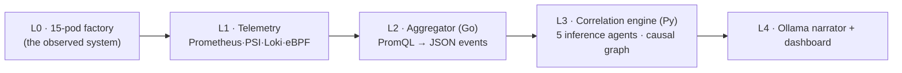

# SiliconKnights Edge Causal AIOps Tool for Kubernetes

Building for ABB Accelerator 2026, Theme 2:
**Beyond monitoring: AI agents for real-time pod resource discovery and dependency mapping**

**Program overview**  
This project invites young innovators to rethink how containerized systems are understood, not just monitored. This challenge offers an opportunity to explore AI-driven approaches that analyze, correlate, and interpret real-time pod behavior. Participants will uncover dependencies, detect anomalies, and generate meaningful insights. It provides an opportunity to solve real-world infrastructure challenges using modern orchestration environments.

**Problem statement**  
Build a container-based automation solution of your choice (like smart solutions for your university or your town).  

The application should have container orchestration platforms — Kubernetes, K3s, MicroK8s, and other lightweight environments, and enable rapid deployment of microservices. But as applications scale, even single-node deployments often host hundreds of pods across multiple namespaces, each with diverse resource patterns including CPU, memory, disk, network usage, and PVC operations.

**Stakeholders**  

- **Engineers** managing containerized environments 
- **Platform/system operators** working with Kubernetes and similar tools
- **Organizations** relying on these systems for performance and reliability
- **Communities** adopting this system to improve efficiency

**Current workarounds**  
While these platforms provide raw metrics, correlating, resource behavior is still extremely challenging, especially when dealing with:  

- Bursty workloads
- Large file I/O
- PVC-based storage stress
- Multi-service dependency behavior
- Sudden anomalies or leaks  

Engineers struggle to answer foundational operational questions such as:  

- Which pod is causing unexpected CPU spikes?
- How are PVC I/O patterns linked to pod restarts?
- Are different services influencing each other’s resource consumption?
- Which workloads need optimization?  

There is currently no unified tool providing real-time, AI-driven correlation across all these resource types in single-node clusters commonly used in edge and industrial environments.

**Desired solution**  
The system must collect, analyze, and correlate real-time resource consumption of pods across all namespaces in a single-node environment. Key capabilities include:  

- Real-time resource discovery (CPU, RAM, disk usage, PVC metrics, network data)
- Multi-agent AI analysis across CPU, Memory, Storage/PVC, and Log/IO
- Interdependency mapping to identify relationships between pods
- Intelligent recommendations for optimization, alerts, and forecasting
- Rich real-time dashboard with graphs, correlations, anomaly timelines, and NLP insights

**Impact and benefits**  
**Impact**  

- A fully running prototype on Minikube, MicroK8s, K3s, or any other orchestration
- Multi-agent AI analysis framework
- Real-time visualization dashboard
- Live demo of insights and interdependency detection
- Technical report describing architecture, pipelines, and methodology

**Benefits**  

- Provides real-time visibility into pod-level resource behavior, preventing performance degradation and downtime
- Improves reliability through AI-driven anomaly detection, bottleneck identification, and dependency understanding

**Current Status: active build, completed till telemetry layer (P2). Live journal in [BUILD_LOG.md](BUILD_LOG.md).**

---
## What it answers:

Industrial edge boxes run dozens of interdependent pods sharing CPU, memory, disk, PVCs, and network. When something degrades, `kubectl top` shows us *what* is hot, never *who made it hot*. This tool answers the four operational questions from the problem statement, on stage, in under 30 seconds:

1. **Which pod is causing unexpected CPU spikes?**
2. **How are PVC I/O patterns linked to pod restarts?**
3. **Are different services influencing each other's resource consumption?**
4. **Which workloads need optimization?**

> Monitoring tells you *what* is hot. We tell you *who made it hot, who's next, and what to do* — on one node, offline. The LLM is the spokesperson for a deterministic detective, never the detective.

## How it works (L0 → L4)



- **L0 - Factory (observed):** a 15-pod synthetic smart factory (using MQTT telemetry, TimescaleDB, cooling/vision/control pods) that is used to reproduce real failure classes via kernel function: CFS throttling, page-cache writeback, fsync storms, OOM kills. 
- **L1 - Telemetry (reading directly from said factory):** Prometheus (5s scrape on L0) + kubelet cAdvisor **PSI** (the differentiator here is the kernel ground truth: that a pod is stalled, not just busy) + Loki/Alloy logs + eBPF (Caretta flows, OBI RED latency, Inspektor Gadget block-IO).
- **L2 - Aggregator (Go):** polls the PromQL pack, normalizes response to a schema-frozen JSON event contract, runs a deterministic threshold engine, serves a 15 minute per-pod ring buffer at `/window`.
- **L3 - Correlation engine (Python, the heart of our system):** five deterministic inference agents: EWMA+CUSUM changepoint detection, lagged cross-correlation, an evidence gate (statistical strength + physical witness [eBPF/PSI/shared-PVC] + temporal order), explanatory-reach root-cause ranking, and blast-radius forecasting. **No LLMs are being used in the reasoning core**; eliminating hallucinated inferences, and non deterministic responses.
- **L4 - Language + dashboard:** one local Ollama model turns the verdict by the engine into plain-English remediation (here too, the entire dependence is not on the model, we have a fallback methodology which simply passes on the inferred keyword tags). Next.js dashboard: live React-Flow causal graph, PSI noisy-neighbour heatmap, and scenario console.

## Why it's different

No existing tool covers all five of: multi-resource correlation · automatic dependency map · *causal* root cause · edge/air-gap fit · local-LLM insight. SaaS APMs (Datadog/Dynatrace) phone home; service meshes (Istio/Kiali) see only the wire and miss disk/CPU/PSI interference; Pixie doesn't support K3s; Causely is closed SaaS. We hold the intersection — edge + causal + storage-aware + local AI. Full matrix in [MASTER_PLAN.md](MASTER_PLAN.md) §3.

## Repository layout

| Path | Contents |
|---|---|
| `workloads/` | 15 L0 pod sources + Dockerfiles |
| `deploy/` | Helm umbrella chart (`charts/factory`), `skctl` bootstrap, Prometheus/Loki values |
| `aggregator/` | L2 Go service + frozen `event.schema.json` + PromQL pack |
| `correlation/` | L3 engine (`detectors · lagcorr · gate · ranking · pipeline`) + unit tests |
| `scenarios/` | S0–S5 chaos triggers, runbooks, rehearsal ledger |
| `appendix/` | Ops scripts: `verify_taps`, `diag_scrape`, `component_check`, `restart_test` |
| `agents/`, `dashboard/` | L3 agent wiring / L4 frontend (planned) |
| `MASTER_PLAN · BUILD_GUIDE · BUILD_LOG · EXPLANATIONS` | architecture · build path · decision journal · human narrative |

## Prerequisites

- Linux **bare-metal or VM** (not WSL2 as a cluster node) — Ubuntu/Xubuntu 24.04+, kernel ≥ 5.15 with `/sys/kernel/btf/vmlinux` (eBPF CO-RE), cgroup v2, `CONFIG_PSI=y`.
- **K3s v1.34+**: `curl -sfL https://get.k3s.io | INSTALL_K3S_EXEC="--disable traefik --kubelet-arg=feature-gates=KubeletPSI=true" sh -`
- `helm`, and `docker` or `nerdctl` for image builds.
- 16 GB+ RAM (see [MASTER_PLAN.md](MASTER_PLAN.md) §1.7 budget); ~64 GB free disk for the 14-day TimescaleDB window.

Verify the gate: `kubectl get --raw /api/v1/nodes/$(kubectl get no -o name|cut -d/ -f2)/proxy/metrics/cadvisor | grep -m1 container_pressure`

## Build

```bash
# on the K3s box (needs docker or nerdctl). registry/tag come from chart values: skn/<name>:v0.1
for d in workloads/*/; do docker build -t skn/$(basename "$d"):v0.1 "$d"; done
# air-gap: import into K3s containerd so no registry/egress is needed at runtime
for d in workloads/*/; do docker save skn/$(basename "$d"):v0.1 | sudo k3s ctr images import -; done

make test        # L3 engine unit tests (correlation/ pytest)
helm lint deploy/charts/factory
```

## Deploy

```bash
# solo mode = everything on one box (the product target + demo fallback)
./deploy/skctl up --mode solo
bash appendix/component_check.sh      # P0–P2 component sweep
bash appendix/verify_taps.sh          # §2.7 telemetry tap gate (--strict once eBPF collectors are in)
```

- **Fleet mode:** run the same installer on each LAN box; the first up becomes the K3s seed, each box flips on its own component switches (`--components core,storage,…`). Co-location travels by pod affinity, not machine names.
- **Air-gap:** pre-import the image tarball (above); the Ollama model is baked into its image layer; nothing egresses at runtime.

**Operational guardrails (learned the hard way — see BUILD_LOG):**
- In **solo mode never pass `--components <subset>`** — it's exclusive and disables the unlisted workload groups. Just run `./deploy/skctl up --mode solo` (D-012).
- All PVCs carry `helm.sh/resource-policy: keep`, so a stray Helm run can't delete your data; to truly wipe a volume, `kubectl delete pvc` by hand.
- After a Syncthing/cross-machine sync, run `helm template deploy/charts/factory >/dev/null` once before deploying — catches a torn file in seconds.

## Scenarios (the demo conductor)

`scenarios/S0–S5` are version-controlled, one-click, resettable Chaos-Mesh CRs / native triggers, each with a runbook and reset:
**S1** PVC I/O cascade (the hero) · **S2** large-file I/O starvation · **S3** CPU-throttle interference with *no network edge* · **S4** network degradation + retry storm · **S5** memory-leak → OOM loop (forecast before the kernel kills) · **S0** false-positive drill (10 min idle → zero causal edges).

## Status

| Phase | State |
|---|---|
| P0 environment (kernel/K3s/PSI) | ✅ done |
| P1 15-pod factory | ✅ done (8h soak clean) |
| P2 telemetry (Prometheus/Loki up; Alloy + Caretta + OBI next) | 🔵 in progress |
| P3 aggregator (L2) | 🟡 built + unit-tested; deploy next |
| P4 correlation engine (L3) | ⚪ planned — math kernel unit-tested (13/13 on synthetic fixtures) |
| P5 language · P6 dashboard · P7 scenarios · P8 air-gap/demo | ⚪ planned |

## Documentation

- **[MASTER_PLAN.md](MASTER_PLAN.md)** — full architecture, design decisions, competitive analysis, demo script.
- **[BUILD_GUIDE.md](BUILD_GUIDE.md)** — hands-on phase-by-phase build path P0→P8 with done-when gates.
- **[BUILD_LOG.md](BUILD_LOG.md)** — append-only journal + decision register (D-001…D-013).
- **[EXPLANATIONS.md](EXPLANATIONS.md)** — narrative "human track" journal.

## Team

Soumyadip Das · Shivam Kumar · B Kishan · Aaryan Shyam Pillai — *Theme 2: Beyond monitoring — AI agents for real-time pod resource discovery and dependency mapping.*
