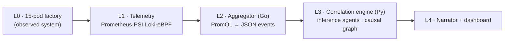

# SiliconKnights Edge Causal AIOps Tool for Kubernetes

Building for ABB Accelerator 2026, Theme 2:
**Beyond monitoring: AI agents for real-time pod resource discovery and dependency mapping**

**Program overview**  
This project invites young innovators to rethink how containerized systems are understood, not just monitored. This challenge offers an opportunity to explore AI-driven approaches that analyze, correlate, and interpret real-time pod behavior. Participants will uncover dependencies, detect anomalies, and generate meaningful insights. It provides an opportunity to solve real-world infrastructure challenges using modern orchestration environments.

**Problem statement**  
Build a container-based automation solution of your choice (like smart solutions for your university or your town).  

The application should have container orchestration platforms — Kubernetes, K3s, MicroK8s, and other lightweight environments, and enable rapid deployment of microservices. But as applications scale, even single-node deployments often host hundreds of pods across multiple namespaces, each with diverse resource patterns including CPU, memory, disk, network usage, and PVC operations.

**Stakeholders**  

- **Engineers** managing containerized environments 
- **Platform/system operators** working with Kubernetes and similar tools
- **Organizations** relying on these systems for performance and reliability
- **Communities** adopting this system to improve efficiency

**Current workarounds**  
While these platforms provide raw metrics, correlating, resource behavior is still extremely challenging, especially when dealing with:  

- Bursty workloads
- Large file I/O
- PVC-based storage stress
- Multi-service dependency behavior
- Sudden anomalies or leaks  

Engineers struggle to answer foundational operational questions such as:  

- Which pod is causing unexpected CPU spikes?
- How are PVC I/O patterns linked to pod restarts?
- Are different services influencing each other’s resource consumption?
- Which workloads need optimization?  

There is currently no unified tool providing real-time, AI-driven correlation across all these resource types in single-node clusters commonly used in edge and industrial environments.

**Desired solution**  
The system must collect, analyze, and correlate real-time resource consumption of pods across all namespaces in a single-node environment. Key capabilities include:  

- Real-time resource discovery (CPU, RAM, disk usage, PVC metrics, network data)
- Multi-agent AI analysis across CPU, Memory, Storage/PVC, and Log/IO
- Interdependency mapping to identify relationships between pods
- Intelligent recommendations for optimization, alerts, and forecasting
- Rich real-time dashboard with graphs, correlations, anomaly timelines, and NLP insights

**Impact and benefits**  
**Impact**  

- A fully running prototype on Minikube, MicroK8s, K3s, or any other orchestration
- Multi-agent AI analysis framework
- Real-time visualization dashboard
- Live demo of insights and interdependency detection
- Technical report describing architecture, pipelines, and methodology

**Benefits**  
- Provides real-time visibility into pod-level resource behavior, preventing performance degradation and downtime
- Improves reliability through AI-driven anomaly detection, bottleneck identification, and dependency understanding


**Status**

Active build, currently in the correlation layer (P4). The factory (L0), core telemetry (L1), and aggregator (L2) are operational on the cluster; the correlation engine (L3) is deployed and being tuned. See the status table below and the [build log](BUILD_LOG.md).

---

## Overview

The system observes per-pod resource behaviour across all namespaces on a single-node cluster and attributes observed degradation to a likely root cause. Detection operates on kernel-level signals (PSI, cgroup metrics, eBPF) and does not require any modification or instrumentation of the observed applications. It is intended to answer four operational questions:

1. Which pod is causing unexpected CPU spikes?
2. How are PVC I/O patterns linked to pod restarts?
3. Are different services influencing each other's resource consumption?
4. Which workloads need optimization?

## Architecture (L0 to L4)



**L0, factory (observed system).** A 15-pod synthetic factory (MQTT telemetry, TimescaleDB, and cooling, vision, and control services) that reproduces representative failure classes (CPU throttling, page-cache writeback, fsync storms, OOM termination) using real kernel mechanisms rather than injected metric values.

**L1, telemetry.** Prometheus scrapes the factory namespaces every 5 seconds. Signals include kubelet cAdvisor metrics with Pressure Stall Information (PSI), container logs via Loki and Grafana Alloy, and eBPF-derived data (Caretta network flows, OBI request metrics, Inspektor Gadget block I/O). No application instrumentation is required.

**L2, aggregator (Go).** Queries Prometheus on a fixed interval, normalizes the results into a schema-stable JSON event format, applies deterministic threshold rules, and serves a 15-minute per-pod history at `/window`.

**L3, correlation engine (Python).** Five deterministic inference stages: changepoint detection (EWMA and CUSUM), lagged cross-correlation, an evidence gate (statistical strength, a physical witness such as an eBPF link or PSI co-pressure or a shared volume, and temporal ordering), root-cause ranking by explanatory reach, and blast-radius forecasting. No language model is used in this stage.

**L4, language and dashboard.** A local model (Ollama) renders the engine's verdict into a written summary, with a deterministic template fallback when the model is unavailable. The dashboard presents the causal graph, a PSI heatmap, and a scenario console.

## Repository layout

| Path | Contents |
|------|----------|
| `workloads/` | 15 L0 pod sources and Dockerfiles |
| `deploy/` | Helm umbrella chart (`charts/factory`), `skctl` bootstrap, Prometheus/Loki values |
| `aggregator/` | L2 Go service, frozen `event.schema.json`, PromQL pack |
| `correlation/` | L3 engine (`detectors`, `lagcorr`, `gate`, `ranking`, `pipeline`) and unit tests |
| `scenarios/` | S0–S5 triggers, runbooks, rehearsal ledger |
| `appendix/` | Operational scripts (`verify_taps`, `diag_scrape`, `component_check`, `restart_test`, `psi_watch`) |
| `agents/`, `dashboard/` | L3 agent wiring and L4 frontend (planned) |
| `MASTER_PLAN`, `BUILD_GUIDE`, `BUILD_LOG`, `EXPLANATIONS` | architecture, build path, decision journal, narrative notes |

## Prerequisites

- Linux host (bare metal or VM; WSL2 is not supported as a cluster node). Ubuntu or Xubuntu 24.04 or later, kernel 5.15 or newer with `/sys/kernel/btf/vmlinux` present (eBPF CO-RE), cgroup v2, and `CONFIG_PSI=y`.
- K3s v1.34 or later:
  ```bash
  curl -sfL https://get.k3s.io | INSTALL_K3S_EXEC="--disable traefik --kubelet-arg=feature-gates=KubeletPSI=true" sh -
  ```
- `helm`, and `docker` or `nerdctl` for image builds.
- 16 GB RAM or more (see [MASTER_PLAN.md](MASTER_PLAN.md) §1.7). Approximately 64 GB of free disk for the 14-day TimescaleDB retention window.

Confirm the PSI gate:
```bash
kubectl get --raw /api/v1/nodes/$(kubectl get no -o name | cut -d/ -f2)/proxy/metrics/cadvisor | grep -m1 container_pressure
```

## Build

Images are built per workload and imported into the K3s container runtime. The registry prefix and tag are defined in the chart values (`skn/<name>:v0.1`).

```bash
make images        # docker build all 15 workloads
make import        # build, then import into K3s containerd (no registry required at runtime)
make test          # engine (pytest) and aggregator (go) unit tests
make charts        # helm lint and template the factory chart
```

## Deploy

Solo mode deploys all components on a single machine.

```bash
./deploy/skctl up --mode solo
bash appendix/component_check.sh      # P0 to P2 component check
bash appendix/verify_taps.sh          # telemetry tap check (add --strict once eBPF collectors are installed)
```

Fleet mode runs the same installer on each LAN node; the first node up becomes the K3s seed, and each node enables its own component groups (`--components core,storage,...`). Co-location is expressed through pod affinity rather than machine names.

For air-gapped operation, pre-import the image tarball, bake the Ollama model into its image layer, and run with no external network access.

**Operational notes:**

- In solo mode, do not pass `--components <subset>`. The flag is exclusive and will disable the workload groups that are not listed. Run `./deploy/skctl up --mode solo` (see decision D-012).
- All PVCs carry `helm.sh/resource-policy: keep`, so a stray Helm operation cannot delete data. To remove a volume deliberately, use `kubectl delete pvc`.
- After a cross-machine file sync, run `helm template deploy/charts/factory >/dev/null` before deploying, to confirm that no file was truncated in transit.

## Scenarios

Each scenario under `scenarios/` is version-controlled and ships with a runbook and a reset script. Heavy load runs only on trigger.

| ID | Scenario | Mechanism |
|----|----------|-----------|
| S0 | Steady-state control | 10 minutes idle; the system should report no causal edges |
| S1 | PVC I/O contention cascade | Sustained `fio` load on a shared volume |
| S2 | Large-file I/O starvation | Bulk archive read and write |
| S3 | CPU throttle interference | CPU-bound burst under a constrained limit, with no network path between the affected pods |
| S4 | Network degradation and retry amplification | Injected latency on an egress service |
| S5 | Memory leak and OOM termination | Unbounded growth to the container memory limit |

## Status

| Phase | State |
|-------|-------|
| P0 environment (kernel, K3s, PSI gate) | Complete |
| P1 factory (15 pods) | Complete (8-hour soak, no unplanned restarts) |
| P2 telemetry (Prometheus, Loki, eBPF collectors) | In progress |
| P3 aggregator (L2) | Deployed to namespace `aiops`; emits schema-conformant events on S1 |
| P4 correlation engine (L3) | Engine deployed to `aiops` and polling the aggregator; tuning the S1 causal chain (kernel 13 of 13 fixtures) |
| P5 language, P6 dashboard, P7 scenarios, P8 hardening | Planned |

## Documentation

- [MASTER_PLAN.md](MASTER_PLAN.md): architecture, design decisions, and methodology.
- [BUILD_GUIDE.md](BUILD_GUIDE.md): phase-by-phase build path (P0 to P8) with completion criteria.
- [BUILD_LOG.md](BUILD_LOG.md): append-only build journal and decision register.
- [EXPLANATIONS.md](EXPLANATIONS.md): narrative notes for non-specialist readers.

## Team

Soumyadip Das, Shivam Kumar, B Kishan, Aaryan Shyam Pillai.
Theme 2: Beyond monitoring, AI agents for real-time pod resource discovery and dependency mapping.
